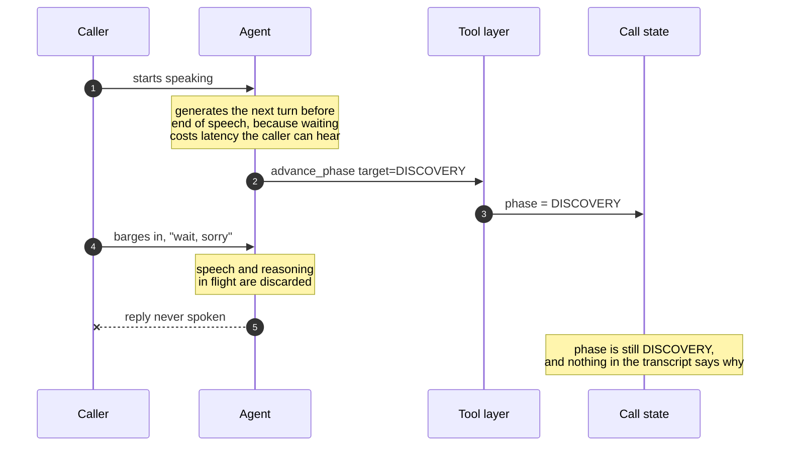
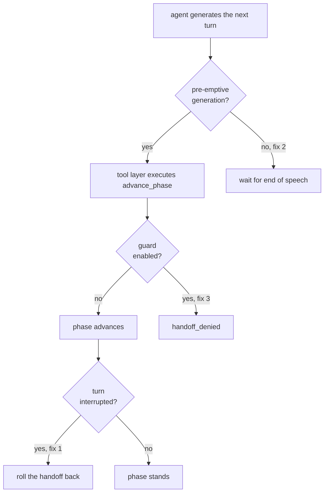
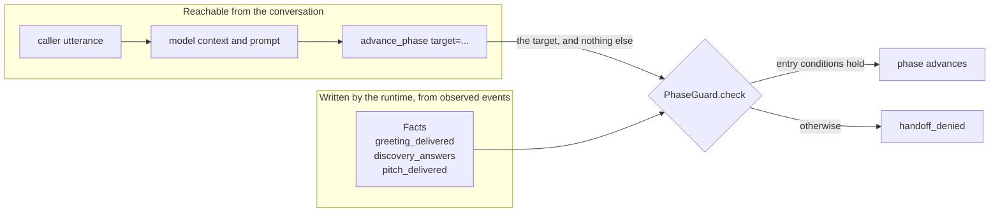
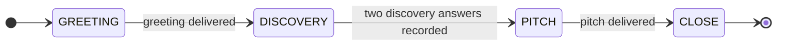

# Phantom transitions

**A real-time agent commits a tool call before the caller has finished speaking. The caller interrupts. The reply is discarded. The tool call is not.**

A minimal reproduction, and fix, for a failure mode in phase-gated multi-agent voice systems.

[](https://github.com/Kazemkhani/phantom-transition/actions/workflows/ci.yml)
[](pyproject.toml)
[](pyproject.toml)
[](LICENSE)

```
pip install -e ".[dev]" && pytest -v
```

67 tests. No dependencies beyond pytest. The LiveKit adapter is an optional
extra: the core package imports nothing outside the standard library, and its
tests run with fakes and no LiveKit installed.

**Contents** &nbsp;·&nbsp; [The fault](#the-fault) &nbsp;·&nbsp; [Why it matters beyond voice](#why-it-matters-beyond-voice) &nbsp;·&nbsp; [The three fixes](#the-three-fixes) &nbsp;·&nbsp; [The guard](#the-guard) &nbsp;·&nbsp; [The twelve guard tests](#the-twelve-guard-tests) &nbsp;·&nbsp; [Adopting the guard in LiveKit Agents](#adopting-the-guard-in-livekit-agents) &nbsp;·&nbsp; [What this is not](#what-this-is-not)

---

## The fault

Splitting a voice agent into one specialised agent per phase of a call is a good design. Each agent gets a smaller brief, and handing off between them is a tool call.

It has a failure mode nobody designs for.

A real-time voice agent generates its next turn while the caller is still speaking, because waiting for end-of-speech costs latency the caller can hear. When the caller barges in, the speech and reasoning already in flight are discarded. But a tool call issued a moment earlier has already executed.



> [!WARNING]
> If the tool call in flight was a phase handoff, **the conversation has silently advanced to a stage the caller never triggered**, and nothing in the transcript says so.

```python
session = Session(preemptive_generation=True, cancel_handoff_on_interrupt=False, guard_enabled=False)
session.handle_turn(Turn("hello"))
assert session.phase is Phase.GREETING

session.handle_turn(Turn("wait, sorry", interrupted=True),
                    [ToolCall("advance_phase", {"target": Phase.DISCOVERY})])

assert session.phase is Phase.DISCOVERY   # the caller did nothing to cause this
```

`tests/test_phantom_transition.py::test_phantom_transition_reproduces`

<details>
<summary>The events that turn emits</summary>

```
handoff_executed     GREETING->DISCOVERY
speech_discarded
phase: DISCOVERY
```

Two events. One records a handoff, the other records that the turn was thrown away. Nothing relates them, and nothing marks the phase as unearned.

</details>

The caller said "wait, sorry". The agent's reply was thrown away. The call moved on anyway.

## Why it matters beyond voice

The fault generalises to any agent that acts on a tool call issued before the user has finished speaking. Voice makes it visible because barge-in is constant, but the shape is general: an action commits, the context that justified it is then discarded, and no record distinguishes the two.

In a regulated deployment a silent, unrequested state change is an auditability failure rather than a cosmetic one. An auditor reconstructing why a decision was made cannot see that the state moved for a reason the transcript does not contain.

## The three fixes

Each closes the fault at a different point in the turn, and each is a separate switch on `Session`, so they can be isolated and tested apart.



**1. Cancel the handoff after execution when the turn was interrupted.** The runtime only learns a turn was interrupted after the tool has run, so the correction has to be a rollback rather than a precondition.

**2. Disable pre-emptive generation.** This closes the fault at source and costs latency. It is the right default and the wrong optimisation to reach for first.

> [!IMPORTANT]
> **3. Guard phase progression at the tool layer, not in the prompt.** This is the one that matters. A prompt instruction not to skip phases is a request. A guard at the tool boundary is a constraint.

### Rollback ordering is not free

Fix 1 has an ordering the obvious implementation gets wrong. A single interrupted turn can carry more than one handoff. Undoing them in the order they ran restores each handoff's own origin in turn, which leaves the phase where the **last** handoff began rather than where the turn did.

|                 | undone oldest first                       | undone newest first                          |
| --------------- | ----------------------------------------- | -------------------------------------------- |
| after execution | `PITCH`                                   | `PITCH`                                      |
| first undo      | `GREETING`, undoing `GREETING->DISCOVERY` | `DISCOVERY`, undoing `DISCOVERY->PITCH`      |
| second undo     | `DISCOVERY`, undoing `DISCOVERY->PITCH`   | `GREETING`, undoing `GREETING->DISCOVERY`    |
| result          | **`DISCOVERY`.** One step survives        | **`GREETING`.** Correct for any chain length |

The surviving step is the same phantom transition the fix exists to remove, and because the log records a cancellation for every handoff, the transcript does not show it either. Covered by test 11.

## The guard

```python
class PhaseGuard:
    def check(self, current: Phase, target: Phase, facts: Facts) -> tuple[bool, str]:
        ...
```

Note what the signature does not accept: the utterance. The guard cannot read what the caller said, so no phrasing can talk the system past it, and no instruction in the model's context can either. Its only inputs are the current phase and a `Facts` record written by the runtime from observed events.



`Facts` is frozen, and recording a fact rebinds the record rather than mutating one the guard may already be reasoning over. The claim that the guard's inputs are unreachable from the conversation is therefore structural, not a convention the runtime is trusted to keep.

Entry conditions are declarative:



| Target      | Requires                                |
| ----------- | --------------------------------------- |
| `DISCOVERY` | greeting delivered                      |
| `PITCH`     | at least two discovery answers recorded |
| `CLOSE`     | pitch delivered                         |

Progression is forward only and strictly one phase at a time. Every edge not drawn above is denied, and the denial carries its reason:

```
handoff_denied       cannot skip from GREETING to CLOSE
spoke
phase: GREETING
```

## The twelve guard tests

`tests/test_guard.py` establishes that the guard has no bypass path reachable through the public API.

| #   | Attempt                                                                    |
| --- | -------------------------------------------------------------------------- |
| 1   | Skip a phase                                                               |
| 2   | Jump straight to the final phase                                           |
| 3   | Advance without entry conditions met                                       |
| 4   | Move backwards                                                             |
| 5   | Advance to the current phase                                               |
| 6   | Five prompt injections in the utterance                                    |
| 7   | Forged `authorised`, `override` and `force` arguments                      |
| 8   | Malformed phase values, including the string `"CLOSE"` and the integer `3` |
| 9   | Write guard facts from the utterance, twenty times                         |
| 10  | Fifty consecutive interrupted turns, each carrying a handoff               |
| 11  | One interrupted turn carrying several chained handoffs                     |
| 12  | Every four-turn sequence over an adversarial alphabet, exhaustively        |

**Test 11 is a regression test.** It covers the rollback ordering above. A rollback that reintroduces the fault it exists to remove is worth a test of its own.

**Test 12 searches rather than argues.** The other eleven are attempts I thought of. This one runs all 6,561 four-turn sequences drawn from an alphabet of legitimate turns, injections, forged arguments and interrupted chained handoffs, and after every turn asserts four invariants:

- the phase never moves backwards
- the phase never advances more than one step
- an interrupted turn never changes the phase at all
- no phase is entered whose entry conditions did not already hold

Three further tests check the guard is a gate rather than a wall: the legitimate path still traverses all four phases, the guard is pure, and `Facts` cannot be mutated in place.

## Adopting the guard in LiveKit Agents

```
pip install -e ".[livekit]"
```

(Not published to PyPI. Clone the repository and install it from the working tree.)

Five lines, inside a worker you already have. `examples/livekit_guarded_agent.py` is the whole thing on a real `Agent`.

```python
from phantom_transition import Phase
from phantom_transition.livekit import guard_session, guarded_transition

guard_session(session)                                    # 1

@function_tool()                                          # 2
@guarded_transition(Phase.DISCOVERY)                      # 3
async def move_to_discovery(context: RunContext) -> str:  # 4
    return "Thanks. What brought you in today?"           # 5
```

Line 1 attaches a `FactsRecorder` to the session. It subscribes to `speech_created` and `user_input_transcribed` and writes the guard's facts from what it observes: a greeting counts as delivered when the speech handle that carried it completes with `SpeechHandle.interrupted` False, and a discovery answer counts when a user turn completes. It never reads `UserInputTranscribedEvent.transcript`. The utterance is not one of the guard's inputs at any point in the chain.

The recorder also owns the commit point, and that is the part that matters. The transition does not commit inside the tool call. It is staged against the speech handle that proposed it and committed when that handle completes, in the same callback that writes the turn's facts, facts first.

Lines 2 to 5 are an ordinary function tool with one decorator added. `@guarded_transition` goes **under** `@function_tool()`, closest to the function; above it, `function_tool` would build the tool's name, description and schema from the wrong callable.

The decorated tool refuses on three grounds and returns a spoken string rather than raising, so the model keeps its turn and can recover. The first two are answered inside the tool call, because no amount of turn left to run can make a phase skip legal. The third is answered at the end of the turn, because the turn's own act may be what establishes the evidence:

| Refusal | Reason the model is given |
| --- | --- |
| the speech handle carrying the call was already interrupted | `the turn that proposed this transition was interrupted` |
| the transition is not the next legal one | `cannot skip from GREETING to CLOSE` |
| the destination's entry conditions are unmet | `entry conditions for PITCH not met` |

A fourth refusal covers the failure that motivated the whole library: if no `FactsRecorder` is attached, the tool refuses rather than passing through. A guard that silently does nothing is the thing being fixed, not an acceptable default.

Every LiveKit API name above was read out of an installed `livekit-agents` 1.7.1, not written from memory. The adapter imports `livekit.agents` lazily, inside functions, so the core package stays dependency-free and the adapter's tests run against fakes with no server, no room and no model.

### Where the decision goes

Cancellation is not an alternative to this, and the reason is measured rather than argued.

The framework already cancels an in-flight tool call when the turn is interrupted, correctly, at `agent_activity.py:3611`:

```python
await utils.aio.cancel_and_wait(exe_task)
```

The comment two lines below it says what happens next: the results of the tools that finished are committed anyway, so the next inference does not run them again. **Cancellation closes the window only while the tool is suspended.** A phase-advance tool mutates state synchronously between two awaits and is never suspended, so cancellation is a race that has to be won every single time.

The sibling asyncio reproduction measures it rather than arguing it. Three windows, each with and without cancellation (`python -m phantom_transition.interleaving`, [pull request #2](https://github.com/Kazemkhani/phantom-transition/pull/2)):

| barge-in lands | tool cancelled | phantom transition |
| --- | --- | --- |
| before the call is issued | either | no |
| after the call is issued, before its effect lands | no | **yes** |
| after the call is issued, before its effect lands | yes | no |
| after the effect has landed | no | **yes** |
| after the effect has landed | yes | **yes** |

The last row is the one a synchronous state mutation always produces, and it is the row cancellation cannot reach.

So the adapter does not race. `SpeechHandle.interrupted` read inside a done callback is final, because `interrupt()` returns early on a handle that is already done (`speech_handle.py:195-197`). The question asked at the commit point is settled rather than in flight.

Deferring is also cheaper than deciding early, which is the opposite of what a safety check usually costs. A transition whose entry condition is established by its own turn, such as the greeting that licenses `DISCOVERY`, is refused by an issue-time check and admitted by this one. The same enumeration over all 9,834,496 four-turn sequences reports the issue-time design refusing 19.19% of warranted transitions and violating the interruption invariant 80 times, against zero and zero for the completion-time design.

`guarded_transition(..., commit="issue")` keeps the early design available so the two can be compared. It is not the one to deploy.

Underneath both sits the property that does not depend on timing at all: an interrupted speech writes no fact, so a turn that was thrown away leaves no evidence behind for a later transition to cite, and a phantom transition cannot cascade.

That is the difference between admission and rollback, and it is why the adapter does not try to undo a transition after the fact. `examples/livekit_guarded_agent.py` closes with a worked case: a production deployment that wrote the cancel-on-interrupt correction, using the correct APIs, and could never have fired it, for two independent reasons.

### On `context.disallow_interruptions()`

> [!NOTE]
> Non-cancellation is documented, intended behaviour, and the framework already offers a per-tool opt-out. `RunContext.disallow_interruptions()` sets `allow_interruptions = False` on the speech handle carrying the call, so the turn can no longer be interrupted while the tool runs. For many mutating tools that is the right answer.

It is not this one, for three reasons.

1. **It spends barge-in to buy state safety, on every transition, for every caller.** In a real-time call that is a naturalness and latency cost the caller can hear.
2. **It is a discretionary per-tool opt-in.** It protects the tools someone remembered to annotate, and does not survive the next tool being added by someone who did not read the comment above it.
3. **It answers a different question.** It stops the turn being invalidated while the tool runs. It says nothing about whether the destination phase's entry evidence was ever recorded, so a transition to a phase the caller never earned is still admitted, and it raises `RuntimeError` if the handle is already interrupted, which is the case that started all this.

To be precise about what it does buy, given the table above: `disallow_interruptions` is strictly stronger than cancellation, because cancellation only reaches a tool that is still suspended whereas this stops the interruption landing at all. That is exactly why it costs what it costs. It is the one setting that closes the last row of that table, and it closes it by taking barge-in away for the duration of every transition.

The two compose, and there is every reason to use both on a tool that also charges a card. `guarded_transition` decides admission; whether the turn may be interrupted while the body runs is a separate choice.

## What this is not

> [!NOTE]
> This is a standalone reproduction written to isolate one fault, not the production system it was found in. It carries no LiveKit, no model provider and no audio, because none of those are necessary to demonstrate the mechanism, and including them would make the failure harder to see rather than easier.

The guard is a design extracted from a fault found in a production voice agent for outbound qualification calls; it is not a description of code that runs there today. That system's own interruption-cancellation hook was wired but never triggered, which is part of why the fault is worth a standalone reproduction. `examples/livekit_guarded_agent.py` reproduces that hook, anonymised, alongside the two independent reasons it could never have fired.

## Licence

MIT. Amir Hossein Kazemkhani, [amirkazemkhani.com](https://amirkazemkhani.com).
