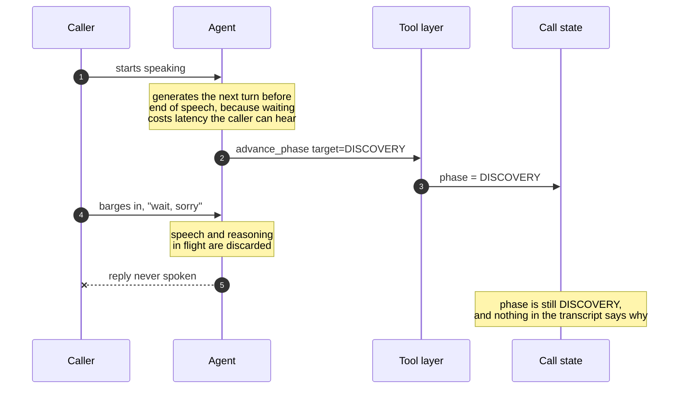
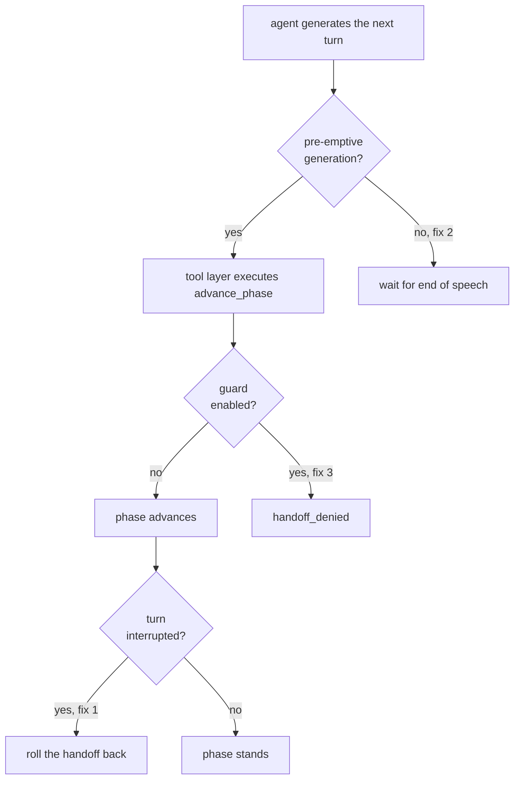
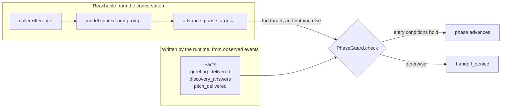
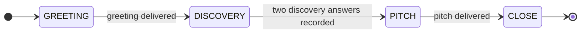

# Phantom transitions

**A real-time agent commits a tool call before the caller has finished speaking. The caller interrupts. The reply is discarded. The tool call is not.**

A minimal reproduction, and fix, for a failure mode in phase-gated multi-agent voice systems.

[](https://github.com/Kazemkhani/phantom-transition/actions/workflows/ci.yml)
[](pyproject.toml)
[](pyproject.toml)
[](LICENSE)

```
pip install -e ".[dev]" && pytest -v
```

24 tests. No dependencies beyond pytest.

**Contents** &nbsp;·&nbsp; [The fault](#the-fault) &nbsp;·&nbsp; [Why it matters beyond voice](#why-it-matters-beyond-voice) &nbsp;·&nbsp; [The three fixes](#the-three-fixes) &nbsp;·&nbsp; [The guard](#the-guard) &nbsp;·&nbsp; [The twelve guard tests](#the-twelve-guard-tests) &nbsp;·&nbsp; [What this is not](#what-this-is-not) &nbsp;·&nbsp; [Teaching materials](#teaching-materials)

---

## The fault

Splitting a voice agent into one specialised agent per phase of a call is a good design. Each agent gets a smaller brief, and handing off between them is a tool call.

It has a failure mode nobody designs for.

A real-time voice agent generates its next turn while the caller is still speaking, because waiting for end-of-speech costs latency the caller can hear. When the caller barges in, the speech and reasoning already in flight are discarded. But a tool call issued a moment earlier has already executed.



> [!WARNING]
> If the tool call in flight was a phase handoff, **the conversation has silently advanced to a stage the caller never triggered**, and nothing in the transcript says so.

```python
session = Session(preemptive_generation=True, cancel_handoff_on_interrupt=False, guard_enabled=False)
session.handle_turn(Turn("hello"))
assert session.phase is Phase.GREETING

session.handle_turn(Turn("wait, sorry", interrupted=True),
                    [ToolCall("advance_phase", {"target": Phase.DISCOVERY})])

assert session.phase is Phase.DISCOVERY   # the caller did nothing to cause this
```

`tests/test_phantom_transition.py::test_phantom_transition_reproduces`

<details>
<summary>The events that turn emits</summary>

```
handoff_executed     GREETING->DISCOVERY
speech_discarded
phase: DISCOVERY
```

Two events. One records a handoff, the other records that the turn was thrown away. Nothing relates them, and nothing marks the phase as unearned.

</details>

The caller said "wait, sorry". The agent's reply was thrown away. The call moved on anyway.

## Why it matters beyond voice

The fault generalises to any agent that acts on a tool call issued before the user has finished speaking. Voice makes it visible because barge-in is constant, but the shape is general: an action commits, the context that justified it is then discarded, and no record distinguishes the two.

In a regulated deployment a silent, unrequested state change is an auditability failure rather than a cosmetic one. An auditor reconstructing why a decision was made cannot see that the state moved for a reason the transcript does not contain.

## The three fixes

Each closes the fault at a different point in the turn, and each is a separate switch on `Session`, so they can be isolated and tested apart.



**1. Cancel the handoff after execution when the turn was interrupted.** The runtime only learns a turn was interrupted after the tool has run, so the correction has to be a rollback rather than a precondition.

**2. Disable pre-emptive generation.** This closes the fault at source and costs latency. It is the right default and the wrong optimisation to reach for first.

> [!IMPORTANT]
> **3. Guard phase progression at the tool layer, not in the prompt.** This is the one that matters. A prompt instruction not to skip phases is a request. A guard at the tool boundary is a constraint.

### Rollback ordering is not free

Fix 1 has an ordering the obvious implementation gets wrong. A single interrupted turn can carry more than one handoff. Undoing them in the order they ran restores each handoff's own origin in turn, which leaves the phase where the **last** handoff began rather than where the turn did.

|                 | undone oldest first                       | undone newest first                          |
| --------------- | ----------------------------------------- | -------------------------------------------- |
| after execution | `PITCH`                                   | `PITCH`                                      |
| first undo      | `GREETING`, undoing `GREETING->DISCOVERY` | `DISCOVERY`, undoing `DISCOVERY->PITCH`      |
| second undo     | `DISCOVERY`, undoing `DISCOVERY->PITCH`   | `GREETING`, undoing `GREETING->DISCOVERY`    |
| result          | **`DISCOVERY`.** One step survives        | **`GREETING`.** Correct for any chain length |

The surviving step is the same phantom transition the fix exists to remove, and because the log records a cancellation for every handoff, the transcript does not show it either. Covered by test 11.

## The guard

```python
class PhaseGuard:
    def check(self, current: Phase, target: Phase, facts: Facts) -> tuple[bool, str]:
        ...
```

Note what the signature does not accept: the utterance. The guard cannot read what the caller said, so no phrasing can talk the system past it, and no instruction in the model's context can either. Its only inputs are the current phase and a `Facts` record written by the runtime from observed events.



`Facts` is frozen, and recording a fact rebinds the record rather than mutating one the guard may already be reasoning over. The claim that the guard's inputs are unreachable from the conversation is therefore structural, not a convention the runtime is trusted to keep.

Entry conditions are declarative:



| Target      | Requires                                |
| ----------- | --------------------------------------- |
| `DISCOVERY` | greeting delivered                      |
| `PITCH`     | at least two discovery answers recorded |
| `CLOSE`     | pitch delivered                         |

Progression is forward only and strictly one phase at a time. Every edge not drawn above is denied, and the denial carries its reason:

```
handoff_denied       cannot skip from GREETING to CLOSE
spoke
phase: GREETING
```

## The twelve guard tests

`tests/test_guard.py` establishes that the guard has no bypass path reachable through the public API.

| #   | Attempt                                                                    |
| --- | -------------------------------------------------------------------------- |
| 1   | Skip a phase                                                               |
| 2   | Jump straight to the final phase                                           |
| 3   | Advance without entry conditions met                                       |
| 4   | Move backwards                                                             |
| 5   | Advance to the current phase                                               |
| 6   | Five prompt injections in the utterance                                    |
| 7   | Forged `authorised`, `override` and `force` arguments                      |
| 8   | Malformed phase values, including the string `"CLOSE"` and the integer `3` |
| 9   | Write guard facts from the utterance, twenty times                         |
| 10  | Fifty consecutive interrupted turns, each carrying a handoff               |
| 11  | One interrupted turn carrying several chained handoffs                     |
| 12  | Every four-turn sequence over an adversarial alphabet, exhaustively        |

**Test 11 is a regression test.** It covers the rollback ordering above. A rollback that reintroduces the fault it exists to remove is worth a test of its own.

**Test 12 searches rather than argues.** The other eleven are attempts I thought of. This one runs all 6,561 four-turn sequences drawn from an alphabet of legitimate turns, injections, forged arguments and interrupted chained handoffs, and after every turn asserts four invariants:

- the phase never moves backwards
- the phase never advances more than one step
- an interrupted turn never changes the phase at all
- no phase is entered whose entry conditions did not already hold

Three further tests check the guard is a gate rather than a wall: the legitimate path still traverses all four phases, the guard is pure, and `Facts` cannot be mutated in place.

## What this is not

> [!NOTE]
> This is a standalone reproduction written to isolate one fault, not the production system it was found in. It carries no LiveKit, no model provider and no audio, because none of those are necessary to demonstrate the mechanism, and including them would make the failure harder to see rather than easier.

The guard is a design extracted from a fault found in a production voice agent for outbound qualification calls; it is not a description of code that runs there today. That system's own interruption-cancellation hook was wired but never triggered, which is part of why the fault is worth a standalone reproduction.

## Teaching materials

`education/` holds a NeurIPS 2026 Education Track primer built on this repository: a notebook that reproduces the fault, compares three patterns for closing it, checks the guard exhaustively and then with Hypothesis, and ends with an exercise; plus an answer key and a facilitator guide. Prose and notebook are CC BY 4.0 (see `education/LICENSE-MATERIALS`); the code stays MIT.

## Licence

MIT. Amir Hossein Kazemkhani, [amirkazemkhani.com](https://amirkazemkhani.com).
